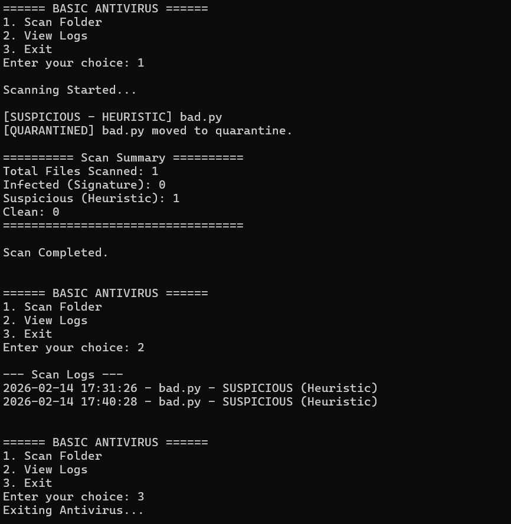

# Hybrid-Antivirus-System

# 🛡 Hybrid Signature + Heuristic Antivirus System

## 🚀 Overview
This project is a Windows-based Hybrid Antivirus Prototype developed in Python.
It combines Signature-Based Detection using SHA-256 hashing with Heuristic Analysis to identify malicious or suspicious files.

---

## 🛡 Detection Techniques
- ✅ Signature-Based Detection (SHA-256 hash comparison)
- ✅ Heuristic Keyword Analysis
- ✅ File Type Filtering (.py, .exe, .txt, .bat)
- ✅ Automated Quarantine System
- ✅ Timestamp-Based Logging
- ✅ Scan Summary Reporting

---

## 📂 Project Structure
- main.py → CLI Interface
- scanner.py → Detection Engine
- hash_utils.py → SHA-256 Hash Generator
- quarantine.py → File Isolation System
- signatures.txt → Malware Signature Database

---

## 🔍 How It Works
1. The system scans files in a specified folder.
2. A SHA-256 hash is generated for each file.
3. The hash is compared with a known malware signature database.
4. If matched → File is marked INFECTED and moved to quarantine.
5. If suspicious keywords are detected → File is marked SUSPICIOUS.
6. All results are logged with timestamps.
7. A scan summary is displayed.

---

## ⚠ Limitations
- Cannot detect unknown zero-day malware fully
- Heuristic detection is keyword-based
- No real-time background scanning

---

## 🔮 Future Improvements
- GUI Interface
- Real-time File Monitoring
- Machine Learning-Based Detection
- Cloud Signature Updates

---
## 📸 Sample Output

## Author
Prachi Tank
